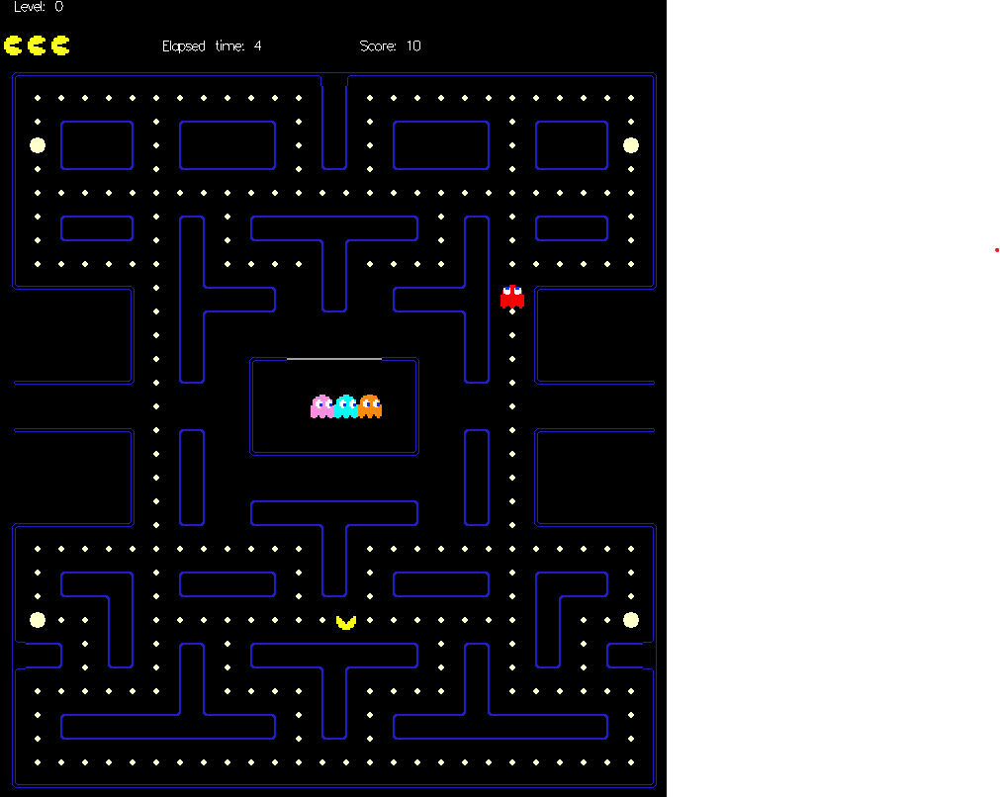

# Haskell-game
Game coded in Haskell made for a project of the Utrecht University. 
[Github Projects](https://docs.github.com/en/issues/planning-and-tracking-with-projects) is used during the development of this project to keep an overview on the progression and backlog of the project. 

## Team
[Jona Leeflang](https://github.com/ChromaChroma)  
[Sem Bode](https://github.com/Sembodi)  

## Setup / How to run the game
- Make sure you have the freeglut.dll in the root of the project. Or use a global Windows 'hack' seen [here](https://stackoverflow.com/questions/8956387/cant-get-freeglut-to-work-with-haskell-on-windows) when using windows.
- Run `cabal update`
- Run `cabal build`
- Run `cabal run`  

And you are Ready to Play!

## Game
The game made in this repository is a game of PacMan created in Haskell using the Gloss library for the Graphical User Interface. PacMan is a game where the player controlles the PacMan, akind of yellow cheesewheel, with the goal to score as many points as possible. During the game PacMan gets attacked by 4 ghosts. By default the player starts with 3 lives. 
Game is based on the old pacman game.  

## Features
Interactions the user can make in the application: 
- Start a game
- Pause the game
  - Quit the game (and save current score?)
- Resume the Game
- Move (Up, Down, Left, Right)
- See highscores

Internal Features:
- Save and load highscores from a file
- Different AI's for the ghosts

Automatic tile rendering:
  The level's tiles are rendered based on their neighbouring tiles, giving us the ability to create any level map without a problem rendering it.

## Optional Features For The Future
- Level/maze maker.
- Custom settings ( lives, timers, durations, span rates, types of AI for each ghost).
- Better graphics.
- Separate Start screen, high score screen, game screen, pause screen.

## Points
Scattered around the level are Dots, Power Pellets and Different special "Fruit". When Pac Man eats all Dots the level is complete and the player continues to the next level. When Pac Man eats a Power Pallet, the ghosts become temporarily Frightend and can be eaten by the Pac Man. Fruit are Bonus Items that spawn later in the game and give extra points to the player when eaten. Fruits change over time to better fruit items.
| Thing                                 | Points |
|---------------------------------------|--------|
| Small Pellet / Dot                    | 10     |
| Power Pellet:                         | 50     |
|   &emsp;1 Ghost eaten                 | 200    |
|   &emsp;2 Ghosts eaten in succession  | 400    |
|   &emsp;3 Ghosts eaten in succession  | 800    |
|   &emsp;4 Ghosts eaten in succession  | 1600   |
| Fruit:                                |        |
|   &emsp;Cherry                        | 100    |
|   &emsp;Strawberry                    | 300    |
|   &emsp;Orange                        | 500    |
|   &emsp;Apple                         | 700    |
|   &emsp;Melon                         | 1000   |
|   &emsp;Galaxian Flagship             | 2000   |
|   &emsp;Bell                          | 3000   |
|   &emsp;Key                           | 5000   |
